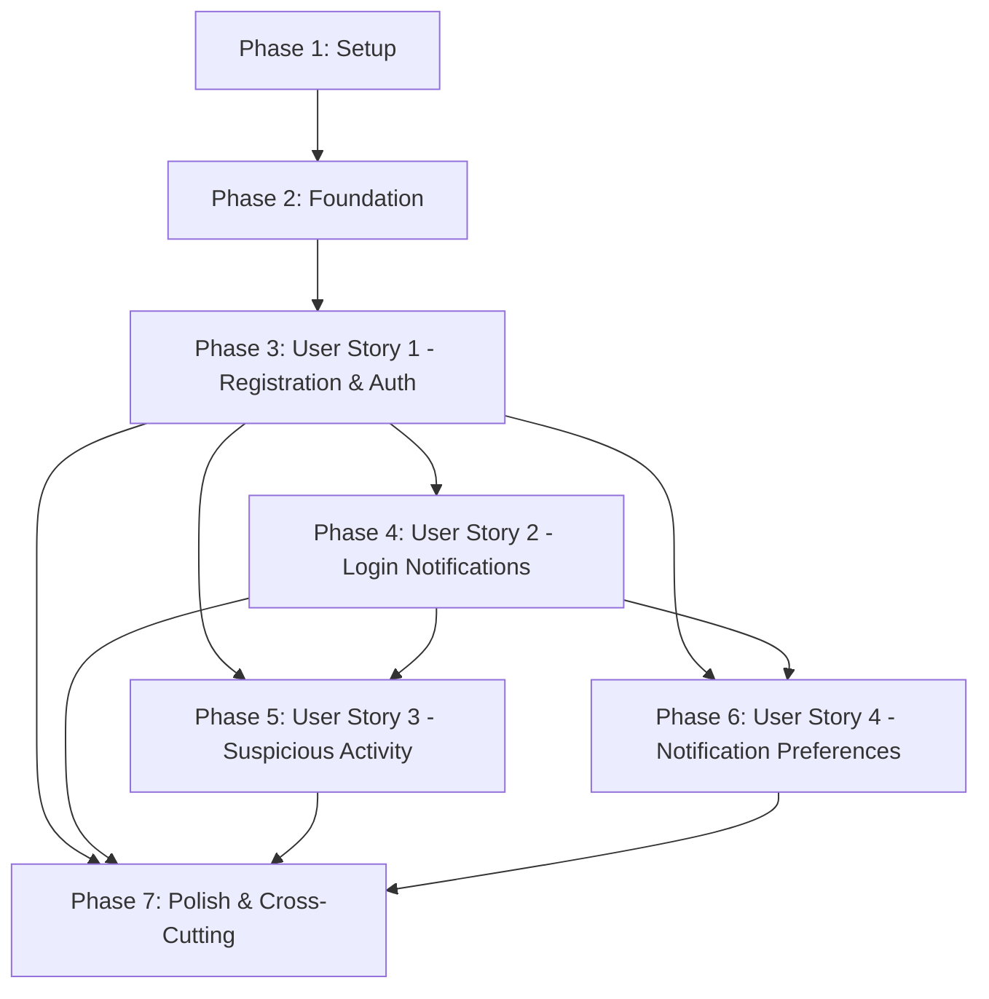

# Tasks: User Login Alerts System

**Input**: Design documents from `/specs/002-user-login-alerts/`  
**Prerequisites**: [plan.md](plan.md), [spec.md](spec.md), [data-model.md](data-model.md), [contracts/api-spec.yaml](contracts/api-spec.yaml), [research.md](research.md), [quickstart.md](quickstart.md)

**Constitutional Requirement**: Per `.specify/memory/constitution.md` Principle III (Test-First Development), tests MUST be written FIRST, approved by user/stakeholder, and FAIL before implementation begins. This enforces the mandatory TDD cycle: Red → Green → Refactor.

**Technology Stack**: .NET 10, C#, ASP.NET Core 10, EF Core 10, PostgreSQL 17+, Redis, Kafka, xUnit, FluentAssertions, Testcontainers

**Project Structure**: Clean Architecture with 4 layers (Domain, Application, Infrastructure, API) organized as separate projects within Identity bounded context

---

## Format: `[ID] [P?] [Story] Description`

- **[P]**: Can run in parallel (different files, no dependencies)
- **[Story]**: Which user story this task belongs to (US1, US2, US3, US4)
- Include exact file paths in descriptions

---

## Phase 1: Setup (Shared Infrastructure)

**Purpose**: Project initialization and foundational structure

- [X] T001 Create Identity bounded context solution structure with 4 Clean Architecture projects
- [X] T002 Initialize Accounting.Identity.Domain project (.NET 10 class library)
- [X] T003 Initialize Accounting.Identity.Application project (.NET 10 class library)
- [X] T004 Initialize Accounting.Identity.Infrastructure project (.NET 10 class library)
- [X] T005 Initialize Accounting.Identity.API project (ASP.NET Core 10 web API)
- [X] T006 [P] Add NuGet packages to Domain project (no external dependencies - only System packages)
- [X] T007 [P] Add NuGet packages to Application project (FluentValidation, MediatR)
- [X] T008 [P] Add NuGet packages to Infrastructure project (EF Core 10, Npgsql.EntityFrameworkCore.PostgreSQL 10, Redis client, Kafka client, Polly)
- [X] T009 [P] Add NuGet packages to API project (Swashbuckle, Serilog, OpenTelemetry)
- [X] T010 [P] Initialize test projects (Domain.Tests, Application.Tests, IntegrationTests, ContractTests)
- [X] T011 [P] Configure EditorConfig for code style enforcement (no magic strings, C# 12 features)
- [X] T012 [P] Create solution-level README.md with architecture overview

---

## Phase 2: Foundational (Blocking Prerequisites)

**Purpose**: Core infrastructure that MUST be complete before ANY user story can be implemented

**⚠️ CRITICAL**: No user story work can begin until this phase is complete

- [X] T013 Create Result and Result<T> pattern base classes in src/Accounting.Identity.Domain/Common/Result.cs
- [X] T014 Create AggregateRoot<TId> base class in src/Accounting.Identity.Domain/Common/AggregateRoot.cs
- [X] T015 Create IDomainEvent interface in src/Accounting.Identity.Domain/Common/IDomainEvent.cs
- [X] T016 Create IRepository<TAggregate, TId> interface in src/Accounting.Identity.Domain/Interfaces/IRepository.cs
- [X] T017 Create IdentityDbContext with identity schema configuration in src/Accounting.Identity.Infrastructure/Persistence/IdentityDbContext.cs
- [X] T018 Create OutboxMessage entity for Outbox pattern in src/Accounting.Identity.Infrastructure/Persistence/Entities/OutboxMessageEntity.cs
- [X] T019 Create OutboxMessageConfiguration for EF Core in src/Accounting.Identity.Infrastructure/Persistence/Configurations/OutboxMessageConfiguration.cs
- [X] T020 Create initial EF Core migration for identity schema in src/Accounting.Identity.Infrastructure/Persistence/Migrations/ (deferred until full schema ready)
- [X] T021 [P] Create ExceptionMiddleware for global error handling in src/Accounting.Identity.API/Middleware/ExceptionMiddleware.cs
- [X] T022 [P] Create ProblemDetailsFactory for RFC 9457 responses in src/Accounting.Identity.API/Common/ProblemDetailsFactory.cs
- [X] T023 [P] Configure Serilog structured logging in src/Accounting.Identity.API/Program.cs
- [X] T024 [P] Configure OpenTelemetry distributed tracing in src/Accounting.Identity.API/Program.cs
- [X] T025 [P] Setup dependency injection container configuration in src/Accounting.Identity.API/Extensions/ServiceCollectionExtensions.cs
- [X] T026 Create IUnitOfWork interface in src/Accounting.Identity.Domain/Interfaces/IUnitOfWork.cs
- [X] T027 Implement UnitOfWork pattern in src/Accounting.Identity.Infrastructure/Persistence/UnitOfWork.cs
- [X] T028 Create IOutboxProcessor interface in src/Accounting.Identity.Application/Interfaces/IOutboxProcessor.cs
- [X] T029 Implement OutboxProcessor for reliable event publishing in src/Accounting.Identity.Infrastructure/Outbox/OutboxProcessor.cs
- [X] T030 [P] Configure Polly resilience policies (retry, circuit breaker, timeout) in src/Accounting.Identity.Infrastructure/Resilience/ResiliencePolicies.cs
- [X] T031 [P] Setup Redis connection and caching infrastructure in src/Accounting.Identity.Infrastructure/Caching/RedisCacheService.cs
- [X] T032 [P] Setup Kafka producer for domain events in src/Accounting.Identity.Infrastructure/Messaging/KafkaEventPublisher.cs
- [X] T033 Create appsettings.json with configuration sections (ConnectionStrings, Authentication, Redis, Kafka) in src/Accounting.Identity.API/appsettings.json
- [X] T034 Create appsettings.Development.json for local development in src/Accounting.Identity.API/appsettings.Development.json

**Checkpoint**: Foundation ready - user story implementation can now begin in parallel

---

## Phase 3: User Story 1 - User Account Registration and Management (Priority: P1) 🎯 MVP

**Goal**: Enable users to register accounts, authenticate with email/password, and manage their profiles

**Independent Test**: Register new user → Verify email → Login with credentials → Update profile → Logout

**Acceptance Scenarios**:
- New user can register with valid credentials and receives confirmation email
- Registered user can log in with correct credentials
- Logged-in user can update profile information
- Registration with duplicate email shows appropriate error

---

### Tests for User Story 1

> **NOTE: Write these tests FIRST, ensure they FAIL before implementation**

- [X] T035 [P] [US1] Domain test: UserAccount.Register() enforces password complexity requirements in tests/Accounting.Identity.Domain.Tests/Aggregates/UserAccountTests.cs
- [X] T036 [P] [US1] Domain test: UserAccount.Register() enforces email uniqueness validation in tests/Accounting.Identity.Domain.Tests/Aggregates/UserAccountTests.cs
- [X] T037 [P] [US1] Domain test: UserAccount.Authenticate() validates password hash correctly in tests/Accounting.Identity.Domain.Tests/Aggregates/UserAccountTests.cs
- [X] T038 [P] [US1] Domain test: UserAccount.Authenticate() fails when account is locked in tests/Accounting.Identity.Domain.Tests/Aggregates/UserAccountTests.cs
- [X] T039 [P] [US1] Domain test: UserAccount.UpdateProfile() raises ProfileUpdated event in tests/Accounting.Identity.Domain.Tests/Aggregates/UserAccountTests.cs
- [X] T040 [P] [US1] Application test: RegisterUserHandler returns error for invalid email format in tests/Accounting.Identity.Application.Tests/Commands/RegisterUserHandlerTests.cs
- [X] T041 [P] [US1] Application test: AuthenticateUserHandler returns InvalidCredentials error in tests/Accounting.Identity.Application.Tests/Commands/AuthenticateUserHandlerTests.cs
- [ ] T042 [P] [US1] Contract test: POST /auth/register matches OpenAPI schema in tests/Accounting.Identity.ContractTests/AuthEndpointsTests.cs
- [ ] T043 [P] [US1] Contract test: POST /auth/login matches OpenAPI schema in tests/Accounting.Identity.ContractTests/AuthEndpointsTests.cs
- [ ] T044 [P] [US1] Integration test: Complete registration flow with database persistence in tests/Accounting.Identity.IntegrationTests/Flows/RegistrationFlowTests.cs
- [ ] T045 [P] [US1] Integration test: Complete authentication flow with JWT token generation in tests/Accounting.Identity.IntegrationTests/Flows/AuthenticationFlowTests.cs

---

### Implementation for User Story 1

**Domain Layer - Value Objects**

- [X] T046 [P] [US1] Create UserAccountId value object in src/Accounting.Identity.Domain/Aggregates/UserAccount/UserAccountId.cs
- [X] T047 [P] [US1] Create EmailAddress value object with validation in src/Accounting.Identity.Domain/Aggregates/UserAccount/EmailAddress.cs
- [X] T048 [P] [US1] Create PasswordHash value object with BCrypt hashing in src/Accounting.Identity.Domain/Aggregates/UserAccount/PasswordHash.cs
- [X] T049 [P] [US1] Create FullName value object in src/Accounting.Identity.Domain/Aggregates/UserAccount/FullName.cs
- [X] T050 [P] [US1] Create AccountStatus enum in src/Accounting.Identity.Domain/Aggregates/UserAccount/AccountStatus.cs

**Domain Layer - Events**

- [X] T051 [P] [US1] Create UserRegistered domain event in src/Accounting.Identity.Domain/Events/UserRegistered.cs
- [X] T052 [P] [US1] Create UserAuthenticated domain event in src/Accounting.Identity.Domain/Events/UserAuthenticated.cs
- [X] T053 [P] [US1] Create ProfileUpdated domain event in src/Accounting.Identity.Domain/Events/ProfileUpdated.cs

**Domain Layer - Aggregate**

- [X] T054 [US1] Create UserAccount aggregate root with Register() static factory method in src/Accounting.Identity.Domain/Aggregates/UserAccount/UserAccount.cs
- [X] T055 [US1] Add Authenticate() method to UserAccount aggregate in src/Accounting.Identity.Domain/Aggregates/UserAccount/UserAccount.cs
- [X] T056 [US1] Add UpdateProfile() method to UserAccount aggregate in src/Accounting.Identity.Domain/Aggregates/UserAccount/UserAccount.cs
- [X] T057 [US1] Add LockAccount() method to UserAccount aggregate in src/Accounting.Identity.Domain/Aggregates/UserAccount/UserAccount.cs
- [X] T058 [US1] Add UnlockAccount() method to UserAccount aggregate in src/Accounting.Identity.Domain/Aggregates/UserAccount/UserAccount.cs
- [X] T059 [US1] Create IUserAccountRepository interface in src/Accounting.Identity.Domain/Interfaces/IUserAccountRepository.cs

**Infrastructure Layer - Persistence**

- [X] T060 [P] [US1] Create UserAccountEntity persistence entity in src/Accounting.Identity.Infrastructure/Persistence/Entities/UserAccountEntity.cs
- [X] T061 [US1] Create UserAccountEntityConfiguration for EF Core with indexes on email, created_at in src/Accounting.Identity.Infrastructure/Persistence/Configurations/UserAccountEntityConfiguration.cs
- [X] T062 [US1] Create UserAccountMapper for domain/persistence translation in src/Accounting.Identity.Infrastructure/Persistence/Mappers/UserAccountMapper.cs
- [X] T063 [US1] Implement UserAccountRepository with email uniqueness check in src/Accounting.Identity.Infrastructure/Persistence/Repositories/UserAccountRepository.cs
- [X] T064 [US1] Create EF Core migration for user_accounts table in src/Accounting.Identity.Infrastructure/Migrations/

**Application Layer - Commands**

- [X] T065 [P] [US1] Create RegisterUserCommand with request DTO in src/Accounting.Identity.Application/Commands/RegisterUser/RegisterUserCommand.cs
- [ ] T066 [US1] Create RegisterUserValidator with FluentValidation rules in src/Accounting.Identity.Application/Commands/RegisterUser/RegisterUserValidator.cs
- [X] T067 [US1] Create RegisterUserHandler with domain event publishing in src/Accounting.Identity.Application/Commands/RegisterUser/RegisterUserHandler.cs
- [X] T068 [P] [US1] Create AuthenticateUserCommand with credentials in src/Accounting.Identity.Application/Commands/AuthenticateUser/AuthenticateUserCommand.cs
- [ ] T069 [US1] Create AuthenticateUserValidator with FluentValidation rules in src/Accounting.Identity.Application/Commands/AuthenticateUser/AuthenticateUserValidator.cs
- [X] T070 [US1] Create AuthenticateUserHandler with JWT token generation in src/Accounting.Identity.Application/Commands/AuthenticateUser/AuthenticateUserHandler.cs
- [ ] T071 [P] [US1] Create UpdateProfileCommand in src/Accounting.Identity.Application/Commands/UpdateProfile/UpdateProfileCommand.cs
- [ ] T072 [US1] Create UpdateProfileHandler in src/Accounting.Identity.Application/Commands/UpdateProfile/UpdateProfileHandler.cs

**Application Layer - Queries**

- [ ] T073 [P] [US1] Create GetUserProfileQuery in src/Accounting.Identity.Application/Queries/GetUserProfile/GetUserProfileQuery.cs
- [ ] T074 [US1] Create GetUserProfileHandler with AsNoTracking() query in src/Accounting.Identity.Application/Queries/GetUserProfile/GetUserProfileHandler.cs
- [ ] T075 [P] [US1] Create UserProfileDto in src/Accounting.Identity.Application/DTOs/UserProfileDto.cs

**Infrastructure Layer - Services**

- [ ] T076 [P] [US1] Create IPasswordHashingService interface in src/Accounting.Identity.Application/Interfaces/IPasswordHashingService.cs
- [ ] T077 [US1] Implement BCryptPasswordHashingService in src/Accounting.Identity.Infrastructure/Services/BCryptPasswordHashingService.cs
- [ ] T078 [P] [US1] Create IJwtTokenService interface in src/Accounting.Identity.Application/Interfaces/IJwtTokenService.cs
- [ ] T079 [US1] Implement JwtTokenService with Keycloak integration in src/Accounting.Identity.Infrastructure/Services/JwtTokenService.cs

**API Layer - Controllers**

- [ ] T080 [US1] Create AccountsController with POST /auth/register endpoint in src/Accounting.Identity.API/Controllers/AccountsController.cs
- [ ] T081 [US1] Add GET /accounts/me endpoint to AccountsController in src/Accounting.Identity.API/Controllers/AccountsController.cs
- [ ] T082 [US1] Add PUT /accounts/me endpoint to AccountsController in src/Accounting.Identity.API/Controllers/AccountsController.cs
- [ ] T083 [US1] Create AuthenticationController with POST /auth/login endpoint in src/Accounting.Identity.API/Controllers/AuthenticationController.cs
- [ ] T084 [US1] Add POST /auth/refresh endpoint to AuthenticationController in src/Accounting.Identity.API/Controllers/AuthenticationController.cs
- [ ] T085 [US1] Configure JWT Bearer authentication in src/Accounting.Identity.API/Program.cs
- [ ] T086 [US1] Configure Swagger/OpenAPI documentation with Bearer security scheme in src/Accounting.Identity.API/Program.cs
- [ ] T087 [US1] Add rate limiting middleware for authentication endpoints (5 req/10s) in src/Accounting.Identity.API/Middleware/RateLimitingMiddleware.cs

**Checkpoint**: At this point, User Story 1 should be fully functional and testable independently. Users can register, login, and manage profiles.

---

## Phase 4: User Story 2 - Real-time Login Attempt Notifications (Priority: P2)

**Goal**: Send immediate notifications to users when login attempts occur (successful or failed)

**Independent Test**: Attempt login from new device → Verify email notification sent within 60 seconds → Check notification includes IP, location, device info

**Acceptance Scenarios**:
- User receives email notification for successful login with details (time, location, device)
- User receives email notification for failed login attempt
- User can view list of recent login attempts in account dashboard
- User can click "This wasn't me" to immediately lock account

---

### Tests for User Story 2

- [ ] T088 [P] [US2] Domain test: LoginAttempt.RecordSuccess() creates attempt with correct status in tests/Accounting.Identity.Domain.Tests/Aggregates/LoginAttemptTests.cs
- [ ] T089 [P] [US2] Domain test: LoginAttempt.RecordFailure() includes failure reason in tests/Accounting.Identity.Domain.Tests/Aggregates/LoginAttemptTests.cs
- [ ] T090 [P] [US2] Domain test: LoginAttempt.RecordSuccess() raises LoginAttemptRecorded event in tests/Accounting.Identity.Domain.Tests/Aggregates/LoginAttemptTests.cs
- [ ] T091 [P] [US2] Application test: GetLoginHistoryHandler returns paginated results in tests/Accounting.Identity.Application.Tests/Queries/GetLoginHistoryHandlerTests.cs
- [ ] T092 [P] [US2] Application test: NotificationHandler sends email within 60 seconds in tests/Accounting.Identity.Application.Tests/EventHandlers/LoginAttemptNotificationHandlerTests.cs
- [ ] T093 [P] [US2] Contract test: GET /accounts/me/login-history matches OpenAPI schema in tests/Accounting.Identity.ContractTests/LoginHistoryEndpointsTests.cs
- [ ] T094 [P] [US2] Integration test: Login attempt triggers notification delivery in tests/Accounting.Identity.IntegrationTests/Flows/LoginNotificationFlowTests.cs
- [ ] T095 [P] [US2] Integration test: Failed login notification includes failure reason in tests/Accounting.Identity.IntegrationTests/Flows/LoginNotificationFlowTests.cs

---

### Implementation for User Story 2

**Domain Layer - Value Objects**

- [ ] T096 [P] [US2] Create LoginAttemptId value object in src/Accounting.Identity.Domain/Aggregates/LoginAttempt/LoginAttemptId.cs
- [ ] T097 [P] [US2] Create IPAddress value object with validation in src/Accounting.Identity.Domain/Aggregates/LoginAttempt/IPAddress.cs
- [ ] T098 [P] [US2] Create GeographicLocation value object in src/Accounting.Identity.Domain/Aggregates/LoginAttempt/GeographicLocation.cs
- [ ] T099 [P] [US2] Create UserAgent value object with parsing logic in src/Accounting.Identity.Domain/Aggregates/LoginAttempt/UserAgent.cs
- [ ] T100 [P] [US2] Create AttemptStatus enum in src/Accounting.Identity.Domain/Aggregates/LoginAttempt/AttemptStatus.cs
- [ ] T101 [P] [US2] Create FailureReason enum in src/Accounting.Identity.Domain/Aggregates/LoginAttempt/FailureReason.cs

**Domain Layer - Events**

- [ ] T102 [P] [US2] Create LoginAttemptRecorded domain event in src/Accounting.Identity.Domain/Events/LoginAttemptRecorded.cs
- [ ] T103 [P] [US2] Create LoginAttemptFailed domain event in src/Accounting.Identity.Domain/Events/LoginAttemptFailed.cs

**Domain Layer - Aggregate**

- [ ] T104 [US2] Create LoginAttempt aggregate root in src/Accounting.Identity.Domain/Aggregates/LoginAttempt/LoginAttempt.cs
- [ ] T105 [US2] Add RecordSuccess() static factory method to LoginAttempt in src/Accounting.Identity.Domain/Aggregates/LoginAttempt/LoginAttempt.cs
- [ ] T106 [US2] Add RecordFailure() static factory method to LoginAttempt in src/Accounting.Identity.Domain/Aggregates/LoginAttempt/LoginAttempt.cs
- [ ] T107 [US2] Add UpdateLocation() method for async geolocation in src/Accounting.Identity.Domain/Aggregates/LoginAttempt/LoginAttempt.cs
- [ ] T108 [US2] Create ILoginAttemptRepository interface in src/Accounting.Identity.Domain/Interfaces/ILoginAttemptRepository.cs

**Infrastructure Layer - Persistence**

- [ ] T109 [P] [US2] Create LoginAttemptEntity persistence entity in src/Accounting.Identity.Infrastructure/Persistence/Entities/LoginAttemptEntity.cs
- [ ] T110 [US2] Create LoginAttemptEntityConfiguration with indexes on user_id, ip_address, attempted_at in src/Accounting.Identity.Infrastructure/Persistence/Configurations/LoginAttemptEntityConfiguration.cs
- [ ] T111 [US2] Create LoginAttemptMapper for domain/persistence translation in src/Accounting.Identity.Infrastructure/Persistence/Mappers/LoginAttemptMapper.cs
- [ ] T112 [US2] Implement LoginAttemptRepository with pagination support in src/Accounting.Identity.Infrastructure/Persistence/Repositories/LoginAttemptRepository.cs
- [ ] T113 [US2] Create EF Core migration for login_attempts table in src/Accounting.Identity.Infrastructure/Persistence/Migrations/
- [ ] T114 [US2] Create LoginHistoryQueryModel for AsNoTracking() projections in src/Accounting.Identity.Infrastructure/Persistence/QueryModels/LoginHistoryQueryModel.cs

**Application Layer - Commands**

- [ ] T115 [P] [US2] Create RecordLoginAttemptCommand in src/Accounting.Identity.Application/Commands/RecordLoginAttempt/RecordLoginAttemptCommand.cs
- [ ] T116 [US2] Create RecordLoginAttemptHandler in src/Accounting.Identity.Application/Commands/RecordLoginAttempt/RecordLoginAttemptHandler.cs

**Application Layer - Queries**

- [ ] T117 [P] [US2] Create GetLoginHistoryQuery with pagination parameters in src/Accounting.Identity.Application/Queries/GetLoginHistory/GetLoginHistoryQuery.cs
- [ ] T118 [US2] Create GetLoginHistoryHandler with AsNoTracking() and indexed queries in src/Accounting.Identity.Application/Queries/GetLoginHistory/GetLoginHistoryHandler.cs
- [ ] T119 [P] [US2] Create LoginAttemptDto in src/Accounting.Identity.Application/DTOs/LoginAttemptDto.cs

**Application Layer - Event Handlers**

- [ ] T120 [US2] Create LoginAttemptNotificationHandler subscribing to LoginAttemptRecorded event in src/Accounting.Identity.Application/EventHandlers/LoginAttemptNotificationHandler.cs
- [ ] T121 [US2] Add notification template rendering in LoginAttemptNotificationHandler in src/Accounting.Identity.Application/EventHandlers/LoginAttemptNotificationHandler.cs

**Infrastructure Layer - Services**

- [ ] T122 [P] [US2] Create INotificationService interface in src/Accounting.Identity.Application/Interfaces/INotificationService.cs
- [ ] T123 [US2] Implement EmailNotificationService with SMTP configuration in src/Accounting.Identity.Infrastructure/Services/EmailNotificationService.cs
- [ ] T124 [US2] Add Polly retry policy to EmailNotificationService (3 attempts, exponential backoff) in src/Accounting.Identity.Infrastructure/Services/EmailNotificationService.cs
- [ ] T125 [P] [US2] Create IGeolocationService interface in src/Accounting.Identity.Application/Interfaces/IGeolocationService.cs
- [ ] T126 [US2] Implement IPGeolocationService with external API integration in src/Accounting.Identity.Infrastructure/Services/IPGeolocationService.cs
- [ ] T127 [US2] Add Redis caching to IPGeolocationService (TTL: 1 hour) in src/Accounting.Identity.Infrastructure/Services/IPGeolocationService.cs
- [ ] T128 [US2] Create notification email templates in src/Accounting.Identity.Infrastructure/Templates/LoginAttemptEmail.cshtml

**API Layer - Controllers**

- [ ] T129 [US2] Add GET /accounts/me/login-history endpoint to AccountsController in src/Accounting.Identity.API/Controllers/AccountsController.cs
- [ ] T130 [US2] Update AuthenticateUserHandler to record login attempt on success in src/Accounting.Identity.Application/Commands/AuthenticateUser/AuthenticateUserHandler.cs
- [ ] T131 [US2] Update AuthenticateUserHandler to record login attempt on failure in src/Accounting.Identity.Application/Commands/AuthenticateUser/AuthenticateUserHandler.cs

**Checkpoint**: At this point, User Stories 1 AND 2 should both work independently. Users receive notifications for all login attempts.

---

## Phase 5: User Story 3 - Suspicious Activity Detection and Alerts (Priority: P3)

**Goal**: Automatically detect suspicious login patterns and proactively alert users/admins

**Independent Test**: Simulate 5 consecutive failed login attempts → Verify account locked → Verify security alert sent → Admin dashboard shows flagged account

**Acceptance Scenarios**:
- 5 consecutive failed login attempts within 10 minutes triggers account lock and security alert
- Login from unusual geographic location triggers high-priority verification notification
- Multiple suspicious activities trigger admin report
- Off-hours brute force attempts trigger automated admin alerts

---

### Tests for User Story 3

- [ ] T132 [P] [US3] Domain test: SecurityEvent.Create() sets correct severity level in tests/Accounting.Identity.Domain.Tests/Aggregates/SecurityEventTests.cs
- [ ] T133 [P] [US3] Domain test: SecurityEvent.Resolve() updates resolution status in tests/Accounting.Identity.Domain.Tests/Aggregates/SecurityEventTests.cs
- [ ] T134 [P] [US3] Application test: SuspiciousActivityDetector detects brute force pattern in tests/Accounting.Identity.Application.Tests/Services/SuspiciousActivityDetectorTests.cs
- [ ] T135 [P] [US3] Application test: SuspiciousActivityDetector detects geographic anomaly in tests/Accounting.Identity.Application.Tests/Services/SuspiciousActivityDetectorTests.cs
- [ ] T136 [P] [US3] Application test: LockAccountHandler creates SecurityEvent with correct severity in tests/Accounting.Identity.Application.Tests/Commands/LockAccountHandlerTests.cs
- [ ] T137 [P] [US3] Contract test: GET /accounts/me/security-events matches OpenAPI schema in tests/Accounting.Identity.ContractTests/SecurityEventsEndpointsTests.cs
- [ ] T138 [P] [US3] Integration test: 5 failed attempts trigger account lock and notification in tests/Accounting.Identity.IntegrationTests/Flows/SuspiciousActivityFlowTests.cs

---

### Implementation for User Story 3

**Domain Layer - Value Objects**

- [ ] T139 [P] [US3] Create SecurityEventId value object in src/Accounting.Identity.Domain/Aggregates/SecurityEvent/SecurityEventId.cs
- [ ] T140 [P] [US3] Create ThreatType enum in src/Accounting.Identity.Domain/Aggregates/SecurityEvent/ThreatType.cs
- [ ] T141 [P] [US3] Create EventSeverity enum in src/Accounting.Identity.Domain/Aggregates/SecurityEvent/EventSeverity.cs

**Domain Layer - Events**

- [ ] T142 [P] [US3] Create SuspiciousActivityDetected domain event in src/Accounting.Identity.Domain/Events/SuspiciousActivityDetected.cs
- [ ] T143 [P] [US3] Create AccountLocked domain event in src/Accounting.Identity.Domain/Events/AccountLocked.cs
- [ ] T144 [P] [US3] Create SecurityEventCreated domain event in src/Accounting.Identity.Domain/Events/SecurityEventCreated.cs
- [ ] T145 [P] [US3] Create SecurityEventResolved domain event in src/Accounting.Identity.Domain/Events/SecurityEventResolved.cs

**Domain Layer - Aggregate**

- [ ] T146 [US3] Create SecurityEvent aggregate root in src/Accounting.Identity.Domain/Aggregates/SecurityEvent/SecurityEvent.cs
- [ ] T147 [US3] Add Create() static factory method to SecurityEvent in src/Accounting.Identity.Domain/Aggregates/SecurityEvent/SecurityEvent.cs
- [ ] T148 [US3] Add Resolve() method to SecurityEvent in src/Accounting.Identity.Domain/Aggregates/SecurityEvent/SecurityEvent.cs
- [ ] T149 [US3] Create ISecurityEventRepository interface in src/Accounting.Identity.Domain/Interfaces/ISecurityEventRepository.cs

**Infrastructure Layer - Persistence**

- [ ] T150 [P] [US3] Create SecurityEventEntity persistence entity in src/Accounting.Identity.Infrastructure/Persistence/Entities/SecurityEventEntity.cs
- [ ] T151 [US3] Create SecurityEventEntityConfiguration with indexes on user_id, created_at, severity in src/Accounting.Identity.Infrastructure/Persistence/Configurations/SecurityEventEntityConfiguration.cs
- [ ] T152 [US3] Create SecurityEventMapper for domain/persistence translation in src/Accounting.Identity.Infrastructure/Persistence/Mappers/SecurityEventMapper.cs
- [ ] T153 [US3] Implement SecurityEventRepository in src/Accounting.Identity.Infrastructure/Persistence/Repositories/SecurityEventRepository.cs
- [ ] T154 [US3] Create EF Core migration for security_events table in src/Accounting.Identity.Infrastructure/Persistence/Migrations/

**Application Layer - Commands**

- [ ] T155 [P] [US3] Create LockAccountCommand in src/Accounting.Identity.Application/Commands/LockAccount/LockAccountCommand.cs
- [ ] T156 [US3] Create LockAccountHandler that creates SecurityEvent and locks UserAccount in src/Accounting.Identity.Application/Commands/LockAccount/LockAccountHandler.cs
- [ ] T157 [P] [US3] Create UnlockAccountCommand in src/Accounting.Identity.Application/Commands/UnlockAccount/UnlockAccountCommand.cs
- [ ] T158 [US3] Create UnlockAccountHandler in src/Accounting.Identity.Application/Commands/UnlockAccount/UnlockAccountHandler.cs

**Application Layer - Queries**

- [ ] T159 [P] [US3] Create GetSecurityEventsQuery in src/Accounting.Identity.Application/Queries/GetSecurityEvents/GetSecurityEventsQuery.cs
- [ ] T160 [US3] Create GetSecurityEventsHandler with AsNoTracking() queries in src/Accounting.Identity.Application/Queries/GetSecurityEvents/GetSecurityEventsHandler.cs
- [ ] T161 [P] [US3] Create SecurityEventDto in src/Accounting.Identity.Application/DTOs/SecurityEventDto.cs

**Application Layer - Services & Handlers**

- [ ] T162 [P] [US3] Create ISuspiciousActivityDetector interface in src/Accounting.Identity.Application/Interfaces/ISuspiciousActivityDetector.cs
- [ ] T163 [US3] Implement SuspiciousActivityDetector service with rules-based detection in src/Accounting.Identity.Infrastructure/Services/SuspiciousActivityDetector.cs
- [ ] T164 [US3] Add brute force detection rule (5+ failures in 10 minutes) to SuspiciousActivityDetector in src/Accounting.Identity.Infrastructure/Services/SuspiciousActivityDetector.cs
- [ ] T165 [US3] Add geographic anomaly detection rule to SuspiciousActivityDetector in src/Accounting.Identity.Infrastructure/Services/SuspiciousActivityDetector.cs
- [ ] T166 [US3] Add velocity anomaly detection (multiple locations in short time) to SuspiciousActivityDetector in src/Accounting.Identity.Infrastructure/Services/SuspiciousActivityDetector.cs
- [ ] T167 [US3] Create SuspiciousActivityEventHandler subscribing to LoginAttemptFailed event in src/Accounting.Identity.Application/EventHandlers/SuspiciousActivityEventHandler.cs
- [ ] T168 [US3] Create SecurityAlertNotificationHandler subscribing to AccountLocked event in src/Accounting.Identity.Application/EventHandlers/SecurityAlertNotificationHandler.cs

**Infrastructure Layer - Services**

- [ ] T169 [US3] Create high-priority email template for security alerts in src/Accounting.Identity.Infrastructure/Templates/SecurityAlertEmail.cshtml
- [ ] T170 [US3] Add Redis caching for failed attempt tracking (TTL: 15 minutes) in src/Accounting.Identity.Infrastructure/Services/SuspiciousActivityDetector.cs

**API Layer - Controllers**

- [ ] T171 [US3] Add GET /accounts/me/security-events endpoint to AccountsController in src/Accounting.Identity.API/Controllers/AccountsController.cs
- [ ] T172 [US3] Create AdminController with GET /admin/security-events endpoint (admin role required) in src/Accounting.Identity.API/Controllers/AdminController.cs
- [ ] T173 [US3] Add authorization policy for admin role in src/Accounting.Identity.API/Program.cs

**Checkpoint**: All user stories 1-3 should now be independently functional. Suspicious activity is detected and handled automatically.

---

## Phase 6: User Story 4 - Notification Preferences and Management (Priority: P4)

**Goal**: Allow users to customize notification preferences (email, SMS, in-app, frequency)

**Independent Test**: Access notification settings → Disable email notifications → Enable SMS → Trigger login event → Verify only SMS notification sent

**Acceptance Scenarios**:
- User can configure email, SMS, or in-app notification preferences for different event types
- Disabled notification channels are not used for alerts
- User can set notification frequency (immediate, daily digest)
- Notification preferences are respected during login events

---

### Tests for User Story 4

- [ ] T174 [P] [US4] Application test: UpdateNotificationPreferencesHandler respects user choices in tests/Accounting.Identity.Application.Tests/Commands/UpdateNotificationPreferencesHandlerTests.cs
- [ ] T175 [P] [US4] Application test: NotificationHandler skips disabled channels in tests/Accounting.Identity.Application.Tests/EventHandlers/NotificationHandlerTests.cs
- [ ] T176 [P] [US4] Contract test: GET /accounts/me/notifications/preferences matches OpenAPI schema in tests/Accounting.Identity.ContractTests/NotificationEndpointsTests.cs
- [ ] T177 [P] [US4] Contract test: PUT /accounts/me/notifications/preferences matches OpenAPI schema in tests/Accounting.Identity.ContractTests/NotificationEndpointsTests.cs
- [ ] T178 [P] [US4] Integration test: Notification preferences override default behavior in tests/Accounting.Identity.IntegrationTests/Flows/NotificationPreferencesFlowTests.cs

---

### Implementation for User Story 4

**Domain Layer - Value Objects**

- [ ] T179 [P] [US4] Create NotificationPreference value object in src/Accounting.Identity.Domain/Aggregates/UserAccount/NotificationPreference.cs
- [ ] T180 [P] [US4] Create NotificationChannel enum (Email, SMS, InApp) in src/Accounting.Identity.Domain/Aggregates/UserAccount/NotificationChannel.cs
- [ ] T181 [P] [US4] Create NotificationFrequency enum (Immediate, DailyDigest) in src/Accounting.Identity.Domain/Aggregates/UserAccount/NotificationFrequency.cs

**Domain Layer - Aggregate Updates**

- [ ] T182 [US4] Add NotificationPreferences property to UserAccount aggregate in src/Accounting.Identity.Domain/Aggregates/UserAccount/UserAccount.cs
- [ ] T183 [US4] Add UpdateNotificationPreferences() method to UserAccount in src/Accounting.Identity.Domain/Aggregates/UserAccount/UserAccount.cs

**Infrastructure Layer - Persistence**

- [ ] T184 [US4] Update UserAccountEntity with notification preferences JSON column in src/Accounting.Identity.Infrastructure/Persistence/Entities/UserAccountEntity.cs
- [ ] T185 [US4] Update UserAccountEntityConfiguration to map NotificationPreferences as JSON in src/Accounting.Identity.Infrastructure/Persistence/Configurations/UserAccountEntityConfiguration.cs
- [ ] T186 [US4] Create EF Core migration for notification_preferences column in src/Accounting.Identity.Infrastructure/Persistence/Migrations/
- [ ] T187 [US4] Update UserAccountMapper to handle NotificationPreferences serialization in src/Accounting.Identity.Infrastructure/Persistence/Mappers/UserAccountMapper.cs

**Application Layer - Commands**

- [ ] T188 [P] [US4] Create UpdateNotificationPreferencesCommand in src/Accounting.Identity.Application/Commands/UpdateNotificationPreferences/UpdateNotificationPreferencesCommand.cs
- [ ] T189 [US4] Create UpdateNotificationPreferencesHandler in src/Accounting.Identity.Application/Commands/UpdateNotificationPreferences/UpdateNotificationPreferencesHandler.cs

**Application Layer - Queries**

- [ ] T190 [P] [US4] Create GetNotificationPreferencesQuery in src/Accounting.Identity.Application/Queries/GetNotificationPreferences/GetNotificationPreferencesQuery.cs
- [ ] T191 [US4] Create GetNotificationPreferencesHandler in src/Accounting.Identity.Application/Queries/GetNotificationPreferences/GetNotificationPreferencesHandler.cs
- [ ] T192 [P] [US4] Create NotificationPreferencesDto in src/Accounting.Identity.Application/DTOs/NotificationPreferencesDto.cs

**Application Layer - Event Handler Updates**

- [ ] T193 [US4] Update LoginAttemptNotificationHandler to check user preferences before sending in src/Accounting.Identity.Application/EventHandlers/LoginAttemptNotificationHandler.cs
- [ ] T194 [US4] Update SecurityAlertNotificationHandler to respect notification preferences in src/Accounting.Identity.Application/EventHandlers/SecurityAlertNotificationHandler.cs

**Infrastructure Layer - Services**

- [ ] T195 [P] [US4] Create ISmsNotificationService interface in src/Accounting.Identity.Application/Interfaces/ISmsNotificationService.cs
- [ ] T196 [US4] Implement SmsNotificationService with Twilio integration in src/Accounting.Identity.Infrastructure/Services/SmsNotificationService.cs
- [ ] T197 [US4] Add Polly retry policy to SmsNotificationService in src/Accounting.Identity.Infrastructure/Services/SmsNotificationService.cs

**API Layer - Controllers**

- [ ] T198 [US4] Add GET /accounts/me/notifications/preferences endpoint to AccountsController in src/Accounting.Identity.API/Controllers/AccountsController.cs
- [ ] T199 [US4] Add PUT /accounts/me/notifications/preferences endpoint to AccountsController in src/Accounting.Identity.API/Controllers/AccountsController.cs

**Checkpoint**: All user stories (1-4) are now fully implemented and customizable. Users have complete control over their notification experience.

---

## Phase 7: Polish & Cross-Cutting Concerns

**Purpose**: Improvements that affect multiple user stories and ensure production readiness

- [ ] T200 [P] Update OpenAPI documentation with all endpoints and examples in src/Accounting.Identity.API/Program.cs
- [ ] T201 [P] Add XML documentation comments to all public APIs
- [ ] T202 [P] Create integration test for complete user journey (register → login → view history → update preferences) in tests/Accounting.Identity.IntegrationTests/Flows/CompleteUserJourneyTests.cs
- [ ] T203 [P] Performance optimization: Add database indexes for frequently queried columns
- [ ] T204 [P] Performance optimization: Profile queries and add AsNoTracking() where missing
- [ ] T205 [P] Security: Add input sanitization for user-provided strings
- [ ] T206 [P] Security: Implement rate limiting per user (not just per IP)
- [ ] T207 [P] Security: Add CORS policy configuration
- [ ] T208 [P] Create Dockerfile for Identity.API service in src/Accounting.Identity.API/Dockerfile
- [ ] T209 [P] Create Docker Compose configuration for local development stack in docker/docker-compose.yml
- [ ] T210 [P] Update repository README.md with Identity service documentation
- [ ] T211 [P] Create API usage examples in docs/identity-api-examples.md
- [ ] T212 [P] Add health check endpoint GET /health with database connectivity check in src/Accounting.Identity.API/Controllers/HealthController.cs
- [ ] T213 Run quickstart.md validation to ensure setup instructions work end-to-end
- [ ] T214 Code review: Verify all constitutional principles satisfied (Result pattern, no magic strings, domain/persistence separation)
- [ ] T215 Run full test suite and verify 100% pass rate with adequate coverage

---

## Dependencies & Execution Order

### Phase Dependencies

- **Setup (Phase 1)**: No dependencies - can start immediately
- **Foundational (Phase 2)**: Depends on Setup completion - BLOCKS all user stories
- **User Story 1 (Phase 3)**: Depends on Foundational (Phase 2) - No dependencies on other stories
- **User Story 2 (Phase 4)**: Depends on Foundational (Phase 2) + User Story 1 (needs UserAccount aggregate and authentication)
- **User Story 3 (Phase 5)**: Depends on Foundational (Phase 2) + User Story 1 + User Story 2 (needs LoginAttempt tracking for pattern detection)
- **User Story 4 (Phase 6)**: Depends on Foundational (Phase 2) + User Story 1 + User Story 2 (needs notification infrastructure)
- **Polish (Phase 7)**: Depends on all desired user stories being complete

### User Story Dependencies

**Critical Path**: Setup → Foundation → US1 → US2 → US3 → Polish

### Within Each User Story

1. **Tests FIRST** (Red phase) - All test tasks marked [P] can run in parallel
2. **Domain Layer** - Value objects [P] in parallel, then aggregate, then repositories
3. **Infrastructure Layer** - Persistence entities [P] in parallel, then configurations, then mappers, then repositories
4. **Application Layer** - Commands/queries [P] in parallel, then handlers, then event handlers
5. **API Layer** - Controllers and endpoints
6. **Verify Tests PASS** (Green phase)

### Parallel Opportunities

**Within Phase 1 (Setup)**:
- All project initializations can happen in parallel (T002-T005)
- All NuGet package installations can happen in parallel (T006-T009)
- Test project setup and documentation can happen in parallel (T010-T012)

**Within Phase 2 (Foundation)**:
- Common domain classes can be created in parallel (T013-T016)
- Middleware and factories can be created in parallel (T021-T022)
- Infrastructure services can be configured in parallel (T023-T024, T030-T032)

**Within User Story 1**:
- All domain tests can run in parallel (T035-T045)
- All value objects can be created in parallel (T046-T050)
- All domain events can be created in parallel (T051-T053)
- Command/Query creation can happen in parallel (T065, T068, T071, T073)
- Interface definitions can happen in parallel (T076, T078)

**Within User Story 2**:
- All domain tests can run in parallel (T088-T095)
- All value objects can be created in parallel (T096-T101)
- All domain events can be created in parallel (T102-T103)
- Command/Query creation can happen in parallel (T115, T117)
- Interface definitions can happen in parallel (T122, T125)

**Within User Story 3**:
- All tests can run in parallel (T132-T138)
- All value objects and enums can be created in parallel (T139-T141)
- All domain events can be created in parallel (T142-T145)
- Command creation can happen in parallel (T155, T157)

**Within User Story 4**:
- All tests can run in parallel (T174-T178)
- All value objects and enums can be created in parallel (T179-T181)
- Command/Query creation can happen in parallel (T188, T190)

**Phase 7 (Polish)**:
- All documentation tasks can happen in parallel (T200-T201, T210-T211)
- All performance optimization tasks can happen in parallel (T203-T204)
- All security tasks can happen in parallel (T205-T207)
- All containerization tasks can happen in parallel (T208-T209)

---

## Parallel Example: User Story 1

**Day 1 - Tests & Domain (Parallel)**:

Morning (Parallel):
- Developer A: T035-T039 (Domain tests for UserAccount)
- Developer B: T040-T041 (Application tests for handlers)
- Developer C: T042-T045 (Contract and integration tests)

Afternoon (Parallel):
- Developer A: T046-T050 (All value objects)
- Developer B: T051-T053 (All domain events)
- Developer C: T054-T059 (UserAccount aggregate and repository interface)

**Day 2 - Infrastructure & Application (Sequential with some parallel)**:

Morning:
- Developer A: T060-T064 (Persistence layer) - Sequential (mapper depends on entity)
- Developer B+C: T065-T075 (Commands and queries) - Many can be parallel

Afternoon:
- Developer A: T076-T079 (Services) - Sequential (implementation depends on interface)
- Developer B+C: Continue T065-T075 and start API layer

**Day 3 - API & Integration**:
- All developers: T080-T087 (API endpoints and configuration)
- Test complete US1 flow end-to-end

---

## Implementation Strategy

### MVP Delivery (Minimum Viable Product)

**Recommended MVP Scope**: User Story 1 (P1) ONLY

**Rationale**: User Story 1 provides complete user management without notification complexity. This delivers:
- User registration and onboarding
- Secure authentication
- Profile management
- Foundation for future features

**MVP Timeline**: ~1-2 weeks for Phase 1 + Phase 2 + Phase 3

### Incremental Delivery Path

1. **Week 1-2**: Setup + Foundation + US1 (MVP) → Deploy to staging for user testing
2. **Week 3**: US2 (Notifications) → Deploy, gather feedback on notification delivery
3. **Week 4**: US3 (Security Detection) → Deploy, monitor false positive rates
4. **Week 5**: US4 (Preferences) → Deploy complete feature set
5. **Week 6**: Polish, performance testing, production deployment

### Risk Mitigation

- **Email Delivery**: Test with Ethereal.email first, then configure production SMTP
- **Geolocation API**: Use fallback to IP database file if API unavailable
- **Kafka Outbox**: Implement Outbox pattern early to avoid message loss
- **Performance**: Load test with 1000 concurrent users before production
- **Security**: Penetration test after US3 completion

---

## Task Summary

**Total Tasks**: 215 tasks across 7 phases

**Tasks by Phase**:
- Phase 1 (Setup): 12 tasks
- Phase 2 (Foundation): 22 tasks
- Phase 3 (US1): 52 tasks (11 tests + 41 implementation)
- Phase 4 (US2): 44 tasks (8 tests + 36 implementation)
- Phase 5 (US3): 42 tasks (7 tests + 35 implementation)
- Phase 6 (US4): 27 tasks (5 tests + 22 implementation)
- Phase 7 (Polish): 16 tasks

**Tasks by User Story**:
- User Story 1 (P1): 52 tasks
- User Story 2 (P2): 44 tasks
- User Story 3 (P3): 42 tasks
- User Story 4 (P4): 27 tasks

**Parallel Opportunities**: 78 tasks marked [P] can run in parallel with other tasks in their phase

**Independent Test Criteria**:
- US1: Complete registration → login → profile update flow works independently
- US2: Login notifications sent within 60 seconds works independently
- US3: Suspicious activity detection and lockout works independently
- US4: Notification preferences respected works independently

**Suggested MVP Scope**: Phase 1 + Phase 2 + Phase 3 (User Story 1 only) = 86 tasks for core user management

---

## Format Validation

✅ All tasks follow checklist format: `- [ ] [TaskID] [P?] [Story?] Description with file path`  
✅ All user story tasks include [US1], [US2], [US3], or [US4] labels  
✅ All parallelizable tasks include [P] marker  
✅ All task descriptions include exact file paths  
✅ Sequential task IDs (T001-T215) in execution order  
✅ Tests written BEFORE implementation for each user story  
✅ Each user story independently testable  
✅ Clear dependency graph showing story completion order  
✅ Parallel execution opportunities identified per story